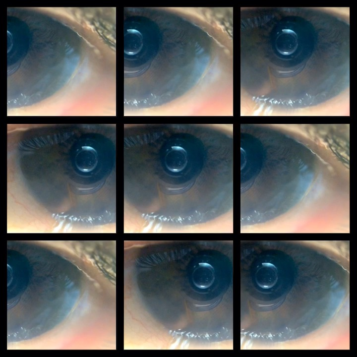

# Album Artífice de Automata

Debemos recuperar el derecho a la construcción en letra y obra.  El mundo que nos llevo a perderlo ahora nos permite recuperarlos.  Pero ese derecho lo perdímos nosotros mismos, o dejamos que nos lo quietaran. Debemos tranformarnos nuevamente en Artífices de cambio!

Artífice es un album de música experimental y arte sonoro. Parte del fundamente de la programación y juego de contrucción sonora a través de la programación, pero también de la utilización de lenguajes para construcción de objetos físicos sonoros llamados [Polymathbox](https://polymathbox.wordpress.com/).  El album ejecuta 9 tracks simultáneos en YouTube, que debido a la latencia de apertura e inico del los videos, crea una ejecución única cada vez que se inicia la página (hacer refresh).

Si quiere descargar el album, es decir, descargar los archivos HTML, hacer click en el botón Verde Arriba a la derecha, y luego abrir el archivo index.html para iniciar.

Para la grabación se utilizaron los polymathboxes, Processing, Arduinos, GUitarra eléctrica, algunos pedales análogos y el mítico Eventide H3000. 

El trabajo es minimalista, tanto el código HTML para las páginas es básico, para facilitar su legibilidad, y simplemente juega con código HTML sencillo.

Grabado y producido por [Automata](https://www.facebook.com/nuevoautomata/) en el anti-estudio (un cuarto de habitación sin lámpara de lava, ni fantasías de rock star)

 Este obra está bajo una <a rel="license" href="http://creativecommons.org/licenses/by-sa/4.0/">licencia de Creative Commons Reconocimiento-CompartirIgual 4.0 Internacional</a>.
